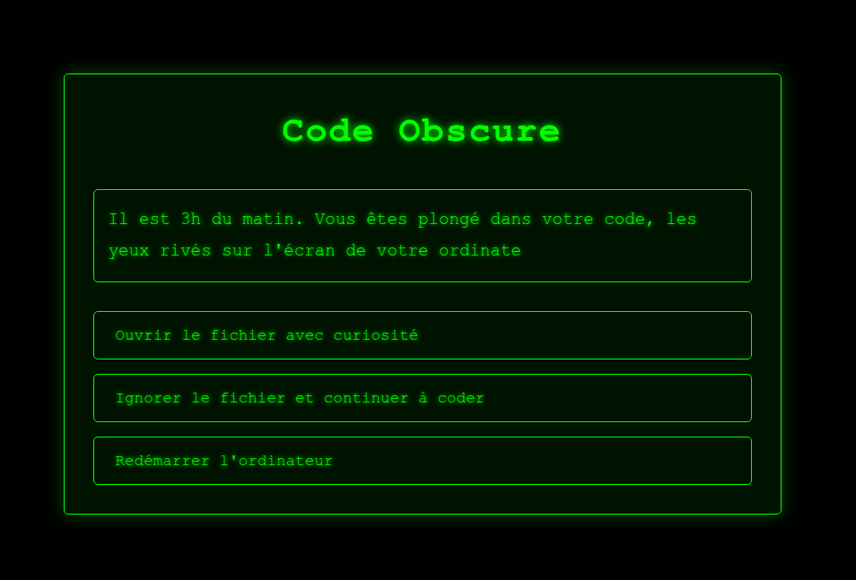

# Code Obscure


*The beginning of your journey in Code Obscure!*

Welcome to **Code Obscure**!

An interactive adventure inspired by "choose your own adventure" books, where every choice matters and Python code is the key to your survival in the Matrix.

---

## 🎁 About
This game was created as a unique birthday present for my dad, to give him a fun, clever, and surprising experience. Happy birthday, Dad!

---

## 🚀 How to Play
1. **Start a local server** in the project folder:
   ```bash
   python3 -m http.server 8000
   ```
2. **Open your browser** and go to:
   [http://localhost:8000](http://localhost:8000)
3. **Read the story** and make your choices to progress through the adventure.
4. **Solve Python puzzles** to advance and try to escape the Matrix!
5. **Enjoy the final surprise...**

---

## 🧩 What to Expect
- Fun and sometimes tricky Python puzzles
- Multiple paths, risks, and a few (virtual) deaths
- A retro Matrix-inspired, green and immersive atmosphere
- A loving birthday message at the end ❤️

---

## 👩‍💻 Who is it for?
- For code enthusiasts, interactive fiction fans, or anyone curious!
- You don't need to be a Python expert—just enjoy thinking and having fun.

---

## ✨ Created with love by Maya Reinaudi-Monzier for her dad, May 13, 2025.

Enjoy the adventure, and happy birthday Dad! 🎂